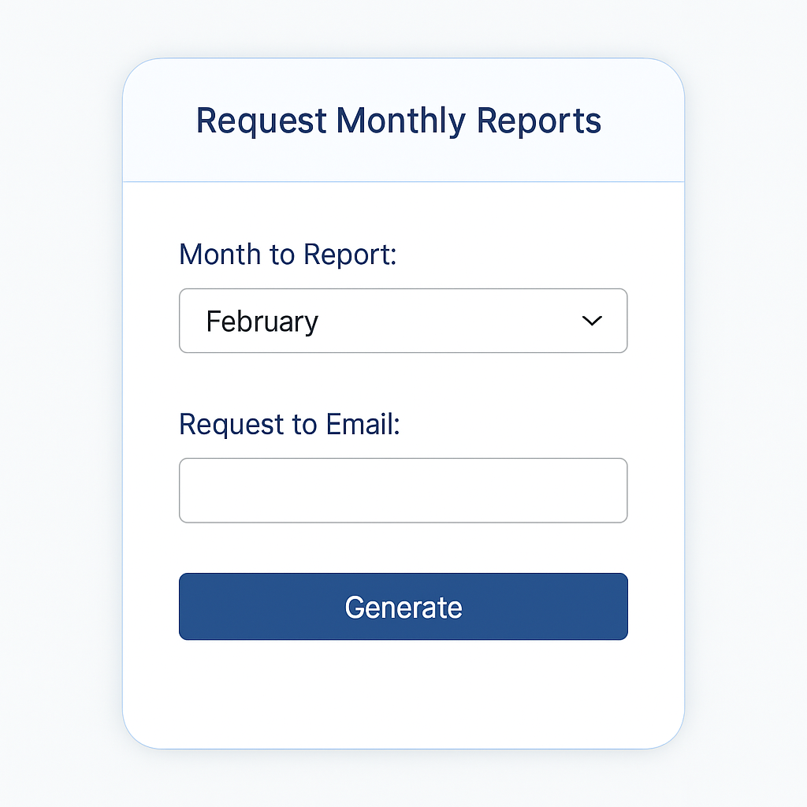

# Automated Monthly Report Generator & Email Dispatcher

**Automates** monthly sales reporting in Excel using VBA:
- builds a Pivot-based monthly report from transactions,
- exports branded PDF reports,
- optionally emails reports to recipients via Outlook,
- includes a UserForm for easy parameter selection.

---

## Demo

---

## Contents
- `report_data.xlsm` — macro-enabled workbook with all code & UI (UserForm).  
- `sample_data/` — CSVs used in examples (`report_transactions.csv`, `report_products.csv`, `report_customers.csv`).  

---

## How to run (quick start)

1. **Download** the repo and open `report_data.xlsm`.  
2. Save it locally: `File → Save As → Excel Macro-Enabled Workbook (.xlsm)`.  
3. Enable macros when Excel asks.  
4. Open the **Run Report** UserForm (Developer → Macros or a provided button).  
5. Choose a month and recipient, then click **Generate**.  
6. The macro will build the Pivot, export PDF to the `outputs/` folder and open Outlook to send (or send automatically if configured).

> **Note:** Outlook must be configured on the machine to send emails programmatically. If you use Gmail with 2-step verification, create an App Password or use OAuth as appropriate.
